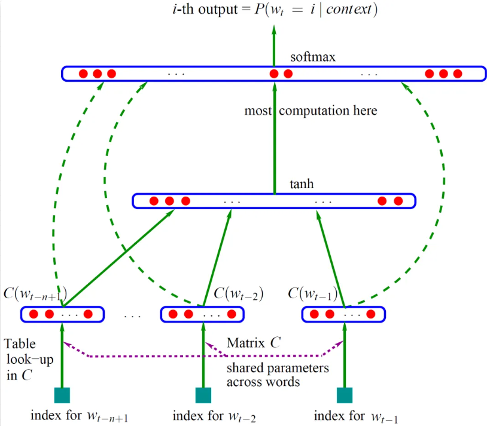

# NNLM
## 概述
NNLM是一个用神经网络训练的语言模型，算法基于n-gram model和词向量，训练之后可以得到词向量和语言模型
## 概念
+ n-gram model   
n元模型是一种用于语言预测的模型，具体来说，会根据前面(n - 1)个词来预测第n个词的概率(n - 1阶的Markov假设)，即计算
$P(w_t|w_{t-1}w_{t-2}...w_{t-(n-1)})$使其最大（在人智导课程中用Viterbi算法实现过二元模型）   
$$
P(w_t|w_{t-1}w_{t-2}...w_{t-(n-1)}) = \frac{Count(w_{t-1}w_{t-2}...w_{t-(n-1)})}{Count(w_{t}w_{t-1}...w_{t-(n-1)})} 
$$
当n取得比较大时，可能分母为0，此时要做平滑
+ 词向量  
将词转化为向量以便计算机表示的一种方式。广义上的词向量一般包括one-hot编码和word embedding，现在一般
指的是word embedding，是一种稠密的编码方式，优势是可以减小向量维度，并且计算词之间的相似性  
## 算法
  
输入层是$(n-1)$组的词向量，在图中$C(w_{i})$表示从词到词向量的映射  
隐藏层是一层全连接层，激活函数是$tanh$  
输出层也是一层全连接层，长度为词表长度，最后通过一层softmax就实现了  
此外输入层到输出层还有可选的直连边，计算输入到输出的线性变换，但论文作者发现并不能提升模型效果，但是可以减少一半的迭代次数  
算法的特殊点在于将词向量也作为待优化的参数，初始时随机设置词向量，通过BP算法迭代优化，因此训练之后不仅能够得到预测的语言模型，还能得到词向量  
相比于一般的n-gram模型，NNLM的优点一是得到了词向量，二是无需做平滑；缺点是计算量太大了

## 参考资料
+ [https://mp.weixin.qq.com/s/hQhvom7OvcIEizP4FQstCg](https://mp.weixin.qq.com/s/hQhvom7OvcIEizP4FQstCg)