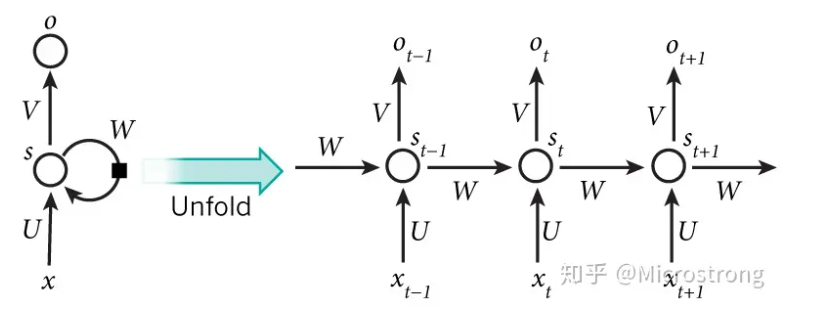
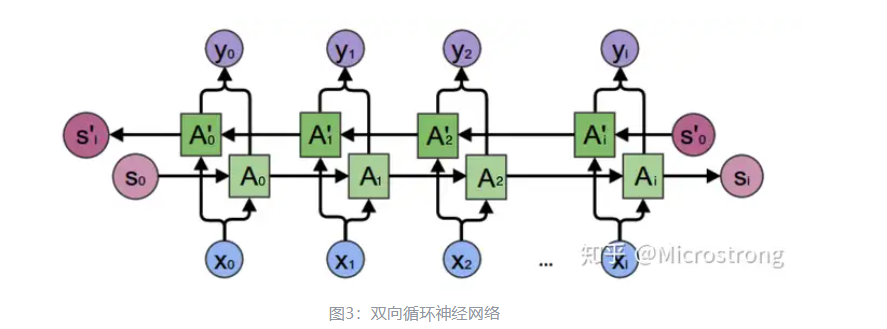

# RNN

## 概述
+ RNN(Recurrent Neural Network): 循环神经网络，是一种广泛用于处理序列信息的神经网络。其特征是在隐藏层中将之前的序列信息也用于输入，因此可以在一定程度上记忆序列的信息，一些应用包括文本翻译、输入法、文本情感预测等等

## 基本循环神经网络
+ 最简单的神经网络，将前一次隐藏层的输入作为下一次的输出，下图左边是网络的实际结构，右图是便于理解展开之后的结构，从中也可看出右图为何是参数共享
$$
s_t = f(Ux_t + Ws_{t - 1})
$$
这里$f$是激活函数，一般是$tanh$

## 双向循环神经网络
+ 基本循环神经网络的一个缺点在于只能利用序列之前的信息，不能利用序列之后的信息，双向循环神经网络则在此基础上增加了反向计算

+ 其中$A_i$参与正向计算，$A_i^{'}$参与反向计算，二者参数不共享
## 参考资料
+ [https://zhuanlan.zhihu.com/p/43190710](https://zhuanlan.zhihu.com/p/43190710)
+ [https://zhuanlan.zhihu.com/p/22266022](https://zhuanlan.zhihu.com/p/22266022)
+ [https://zhuanlan.zhihu.com/p/22338087](https://zhuanlan.zhihu.com/p/22338087)