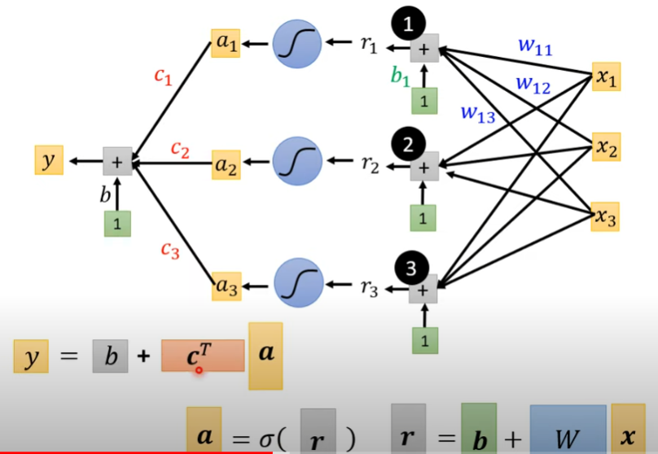

本章主要内容：

+ 后续课程纲要
+ 神经网络基本结构
## 后续课程纲要
+ Lecture 1-5: Supervised Learning
+ Lecture 6: Generative Adversarial Network(GAN，生成对抗网络，特征与标签之间可以不知道其成对的信息)
+ Lecture 7: Self-supervised Learning(自监督学习，在进行Downstream Tasks之前先完成Pre-train)
+ Lecture 8: Anomaly Detection(异常检测，具备辨识出异常输入数据的能力)
+ Lecture 9: Explainable AI(可解释AI，使AI具备可解释性)
+ Lecture 10: Model Attack(模型攻击，给样本加入一些设定的干扰使结果产生巨大偏差)
+ Lecture 11: Domain Adaptation(领域自适应，如何应对训练集和测试集之间的数据漂移)
+ Lecture 12: Reinforcement Learning(强化学习，从结果出发对AI的行为进行奖励或惩罚)
+ Lecture 13: Network Compression(网络压缩，在尽可能保留性能的基础上减少参数)
+ Lecture 14: Life-long Learning(终生学习，如何让AI具备持续学习的能力)
+ Lecture 15: Meta Learning(元学习，如何让AI learn to learn)

## 神经网络基本结构 
+ Model bias  
Model bias刻画了模型本身的限制，即无论如何改变参数都无法很好地完成任务，例如Linear Model难以拟合复杂曲线
+ sigmoid 
 $$
y = csigmoid(w\cdot x + b) = c\frac{1}{1+e^{-(w\cdot x + b)}}
$$
这里利用sigmoid函数来解释activation function的作用：
!!! note  
    sigmoid模拟hard sigmoid（sigmoid的函数比hard sigmoid的函数简单）  
    $\rightarrow$若干hard sigmoid和一个常数偏移可以构成任意piecewise linear model（分段线性函数）  
    $\rightarrow$当折线数目足够多时可以刻画任意曲线
+ Relu  
$$
y = cReLu(w\cdot x + b) = cmax(0, w\cdot x + b)
$$

+ 神经网络基本结构  
{ aline=left }

+ Backpropagation 
