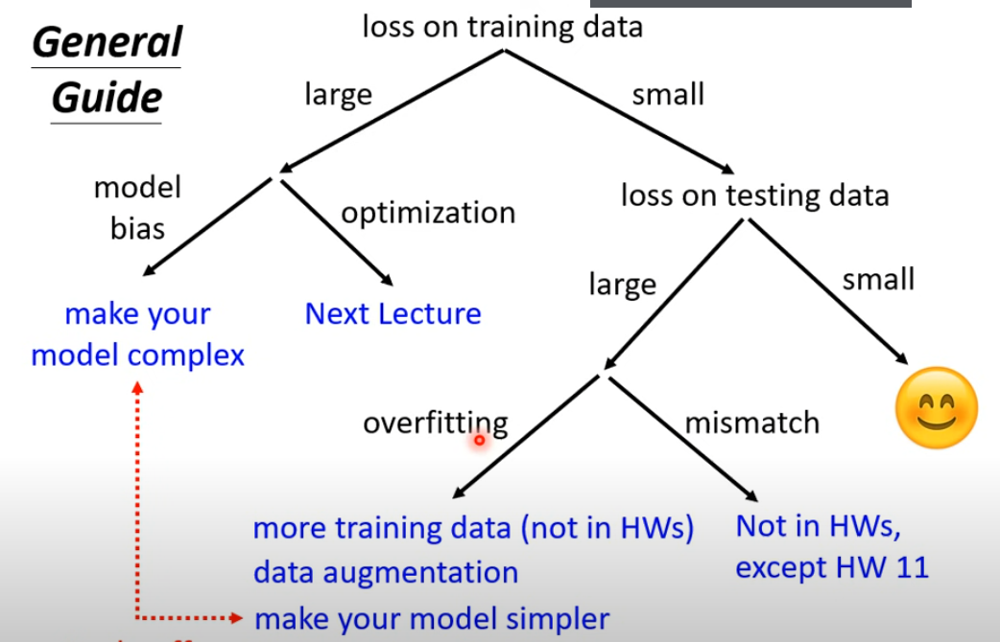

本章主要内容

+ 模型调整指南
+ Optimization problem
## 模型调整指南
 

+ 当模型在训练集上的loss过大时，可能是因为model bias或者optimization的问题。简单来说，model bias是模型本身的复杂度过小，无法刻画出复杂的真实情况，因此无论如何训练都无法使得loss变得很小；optimization problem是没有选用合适的优化方式，或者优化过程中出了一些问题，导致无法选择出使得loss更小的参数（比如gradient descent卡在了某一点无法继续下降等等）
+ 判断是model bias还是optimization problem的一个方法是看选用其它模型（更简单或者更复杂的模型）看是否能得到较小的loss。比如如果使用更简单的模型反而能得到更小的loss，说明是optimization problem的问题；使用更复杂的模型可以得到更大的loss说明是model bias的问题
+ 如果是model bias的问题，则需要换用更复杂的模型，比如增加参数、增加特征或者更改模型等等；如果是optimization problem的问题，则需要使用其它优化方法或者使用一些技巧（之后会讲到）
+ 当模型在训练集上的loss比较小，但在测试集上的loss比较大时，可能是over fitting或者mismatch的问题。简单来说，overfitting是模型过于复杂或者过于依赖训练数据导致loss变大，mismatch则是因为训练集数据和测试集数据的分布不同，导致模型无法在测试集上做出很好的预测。
+ 解决overfitting的方法有很多，主要思路有两种，一是增加训练数据，二是降低模型复杂度。其中降低模型复杂度也有很多方法，例如减少参数个数、共享参数、减少特征、换用更简单的模型、early stopping、regularization、dropout等等
### 数据增强(Data Augmentation)

+ 数据增强是一种在能收集到的样本数据过少的情况下自己产生数据的一种方法。举例来说，如果是图像数据，则可以将图像作一定的截取、对称等处理使得数据变多。

## Optimization Problem

+ Optimization Problem是由于没有选择合适的优化方式而到达一个难以使loss继续下降的情况，为此有许多方法和技巧可以尝试解决这类问题。
### Local Minima & Saddle Point

+ 在我们使用gradient descent进行优化时，可能会存在loss无法继续下降的情况。此时我们有理由怀疑梯度$g$已经很接近于0，因此导致无法下降。这样的点我们称为critical point。
+ critical point又分为多种，比如local minima, local maxima（在loss无法下降的语境下一般不会是local maxima）, saddle point(因为三维情况下形似马鞍，中文称为鞍点)。对于local minima，我们确实难以逃脱，但对于saddle point，我们则可以沿某些方向继续下降。
+ 判别是local minima还是saddle point的一种方法是Hessian矩阵。对critical Point二阶泰勒展开，由于$g$趋近于0，因此，Hessian矩阵的正定性影响了critical point的类型。具体来说，当Hessian矩阵的特征值全为正的时候，此时周围的点全部高于critical point，为local minima；当特征值全为负的时候，为local maxima；当特征值有正有负的时候，为saddle point。
+ 逃离saddle point的一种方式就是沿着特征值为负的特征向量前进。$\displaystyle\frac{1}{2}\mu^T H\mu = \frac{1}{2}\lambda ||\mu||^2\lt 0$，此时可以继续下降
+ 相比于local minima，saddle point出现的频率要大得多得多。因为在参数很多的情况下，Hessian矩阵的维数也会变高，此时要满足特征值全部为正其实是一件很困难的事情

### Batch
+ batch是对数据集做的分割，每次update只拿一个batch来计算loss再更新，每次完整地更新完所有batch叫做一个epoch
+ **Large batch vs Small batch**  
从直观感觉上来说，当batch size比较大的时候，每次update所花的时间比较长，但由于是看完了所有数据，所以更新效果应该比较稳定；而batch size比较小的时候，每次update所花的时间短，但每次看的数据少，所以更新的方向会有noise  
但事实上，如果考虑了GPU的并行运算能力，在一定范围内，batch size小和大的情况下更新时间都差不多，而由于batch size小的时候每次epoch的update次数更多，所以反而是batch size大的时候能够更快的完成训练  
但是batch size小的好处是，noise反而导致了训练出来的模型在训练时和测试时的loss更小，可能是因为由于每次看的数据不一样，因此loss function有细微的差别，对于某一笔batch为critical point的点对于其它batch也许不是，所以因此能不断的下降

### Shuffle
+ shuffle是一种数据预处理技术，意味着打乱训练数据的分布
+ shuffle有利于防止模型的抖动，从而使模型更具有健壮性。如果数据的原有序列具有一定规律（比如前半段数据具有某个特征，后半段数据具有另一个特征），在训练时刚开始会因为一直拿前半段数据训练而学习到前面数据的特征，之后又拿后半段数据训练而学习到后面数据的特征，模型就在这两个方向做摇摆，导致了模型的抖动
+ shuffle还有利于防止模型的过拟合，使得模型学习到正确的特征。如果不做shuffle，模型很可能会去学习数据的顺序特征，从而导致overfitting
+ 一种对batch做shuffle的方式是在每次分割batch的时候都按照不同的方式分割，因此每个epoch的batch是不一样的

### Momentum
+ momentum算法是对gradient descent算法的一个优化。momentum的中文是动量，当一个石头从山坡滚下来时，它可能会因为惯性（或者说还具有一定动量）而滚过某个上坡或盆地。这就是momentum算法的思路：通过考虑以前的gradient来使得度过某些critical point
+ 具体来说，momentum算法的迭代公式具有以下形式:  
$$
m_0 = 0\\\
m_{i + 1} = \lambda m_{i} - \eta g_{i}\\\
\theta_{i + 1} = \theta_{i} + m_{i + 1}
$$
把$m_i$用$g$来表示，可以发现$m$包含了以前的所有的$g$且越近的$g$的影响越大

### Adaptive Learning Rate
+ 在实际使用gradient descent进行优化时，可能会遇到卡在除了critical point的其它情况。比如卡在某个山谷的谷壁的情况（此时gradient不为0，但由于learning rate比较大，所以在两个山谷反复横跳而始终不能跳下去），又或者卡在某个很平缓的下坡，需要迭代很多次才能下去（此时gradient比较小，但由于learning rate也比较小，所以步伐缓慢），因此我们想要自适应的learning rate能够解决上述问题
+ 设计adaptive learning rate算法有一个基本思路：在坡度比较大的地方，需要learning rate比较小，这样可以避免飞出去的情况；在坡度比较小的地方，需要learning rate比较大，这样可以快速迭代到中点，以下介绍一些经典算法  
#### Adagrad
+ Adagrad的迭代算法具有下面的形式：

$$
\theta_{i}^{t + 1} \leftarrow \theta_{i}^{t} - \frac{\eta}{\sigma_i^t}g_i^t\\\
\sigma_i^t = \sqrt{\frac{1}{t + 1}\sum_{k = 0}^t g^k_i}
$$
其中$i$表示参数的编号，$t$表示迭代的次数（从0开始） 

$\sigma$具有调节$g$的作用，当$g$比较大的时候，learning rate比较小，当$g$比较小的时候，learning rate比较大，但需要一定的时间积累，并且Adagrad算法没有考虑不同位置的$g$对学习速率的影响权重的问题，而只是简单的取了方均，导致非常久之前的$g$对learning rate的影响与刚刚的$g$对learning rate的影响是一样大的

#### RMSProp
+ RMSProp算法是对Adagrad的优化，该算法具有下面的形式

$$
\sigma_{i}^{t + 1} = \sqrt{\alpha(\sigma_i^t)^2 + (1 - \alpha)(g^{t})^2}
$$

可以通过调节$\alpha$来控制当前的$g$和之前的$g$对此时的learning rate的影响程度

#### Adam
+ Adam = RMSProp + Momentum

#### Learning Rate Scheduling
+ learning rate scheduling是一种让learning rate随着时间变化的算法。一般来说，我们认为随着迭代次数的增加，我们会逐步地靠近终点，因此我们通常认为刚开始的learning rate要比较大以便快速迭代，最后的learning rate要比较小，以便更靠近终点。learning rate scheduling具有如下的形式

$$
\theta_i^{t + 1} \leftarrow \theta_i^{t} - \frac{\eta ^t}{\sigma_i^t}g_i^t
$$
##### learning rate decay
+ 一种随着时间变化，learning rate单调减小的算法

##### warm up
+ 一种随着时间变化，learning rate先增大后减小的算法
+ warm up的原理是基于$\sigma_i^t$的统计意义，刚开始的时候$\sigma_i^t$并不能很好的对learning rate进行调整，所以刚开始的$\eta^t$比较小是为了快速探索周围环境的热身，之后$\eta^t$变大是为了快速迭代以接近终点，最后的$\eta^t$变小是因为很接近终点了需要减小步伐靠近

### Loss Function
+ loss function的选取不同也可以导致优化效果有很大的不同（比如在分类问题中，CrossEntropy要比MSE要好得多）