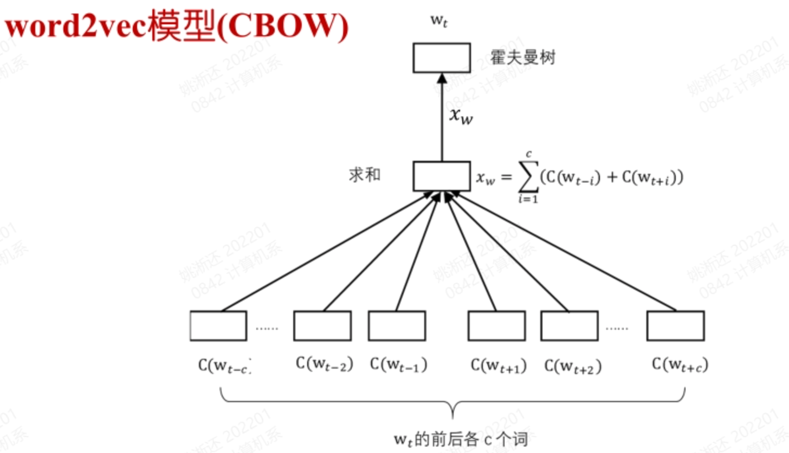

# word2vec
## 概述  
+ word2vec是Google于2013年推出的开源的得到词向量的工具包，包括了一组用于word embedding的模型，使用浅层神经网络进行训练  
+ word2vec的模型分为两种，一种是CBOW模型，一种是Skip-gram模型。对于这两套模型，Word2vec给出了两套框架，分别是基于Hierarchical Softmax和基于Negative Sampling，本节只介绍基于Hierarchical Softmax的CBOW模型

## baseline

+ 上图是一个word2vec的baseline，如图所示，相比于NNLM，该模型删去了Hidden layer，并且将拼接改为了求和，大大减小了计算量。此外，
输出层的每个节点都与输入层的节点全连接（上图未画出），其参数表示了对应词的词向量，通过BP算法更新之后即可得到词向量
+ 上图的模型最后还需要有一层softmax，计算softmax需要遍历所有词典中的词，显然是上述神经网络中计算复杂度最高的一部分，可以进行优化

## Hierarchical Softmax
+ Hierarchical Softmax是一种对Softmax进行优化的框架。具体来说，它利用二叉树实现了分层的Softmax，原本复杂度为$N$，优化之后复杂度为$log N$

## CBOW模型
+ CBOW模型(Continuous bag of words)，连续词袋模型。是一种基于Hierarchical Softmax框架的Word2vec模型。所谓词袋，是指不考虑词在句子中出现的顺序，而统一将它们打包全部装进一个袋子里。对应到模型中就是在Projection layer中使用求和。

+ 在baseline的基础上，取了左右两边的词作为输入，对中间的词进行预测
+ 输出层用一棵Huffman树替代。具体来说，叶子节点与词典中的每个词一一对应，用词出现的频率作为权重构造Huffman树。Huffman树的每一个节点对应一个神经元，与每一个输出层的节点有一个全连接，表示每个节点对应的词向量。每个分支会做一次二分类，正类和负类分类的概率使用sigmoid函数，损失函数为负对数似然函数

## 参考资料
+ [https://www.zybuluo.com/Dounm/note/591752#mjx-eqn-eq4](https://www.zybuluo.com/Dounm/note/591752#mjx-eqn-eq4)